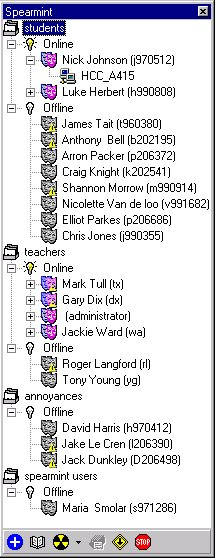



## Spearmint

### Description

Spearmint - The sequel to Mint, is an Instant messenger for NT networks. Spearmint allows you to see who on your NT network is online, and, if they are running Spearmint, send them instant pop-up messages, as well as many other features!
 
### More Info
 

             |
---                |---
**Submitted On**   |2000-09-07 12:20:00
**By**             |[Nick Johnson](https://github.com/Planet-Source-Code/PSCIndex/blob/master/ByAuthor/nick-johnson.md)
**Level**          |Advanced
**User Rating**    |5.0 (20 globes from 4 users)
**Compatibility**  |VB 5\.0, VB 6\.0
**Category**       |[Complete Applications](https://github.com/Planet-Source-Code/PSCIndex/blob/master/ByCategory/complete-applications__1-27.md)
**World**          |[Visual Basic](https://github.com/Planet-Source-Code/PSCIndex/blob/master/ByWorld/visual-basic.md)
**Archive File**   |[CODE\_UPLOAD9700962000\.zip](https://github.com/Planet-Source-Code/nick-johnson-spearmint__1-11317/archive/master.zip)

